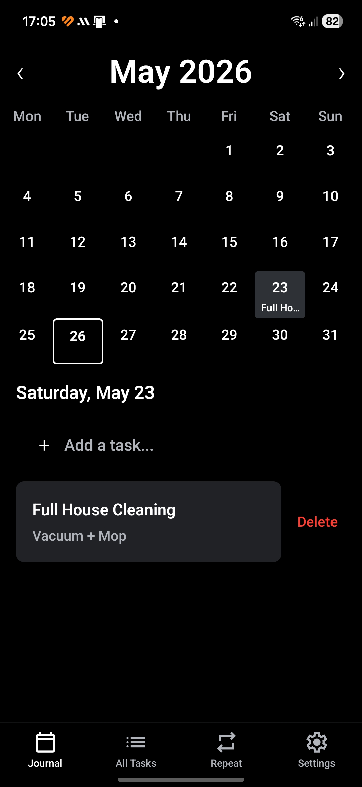
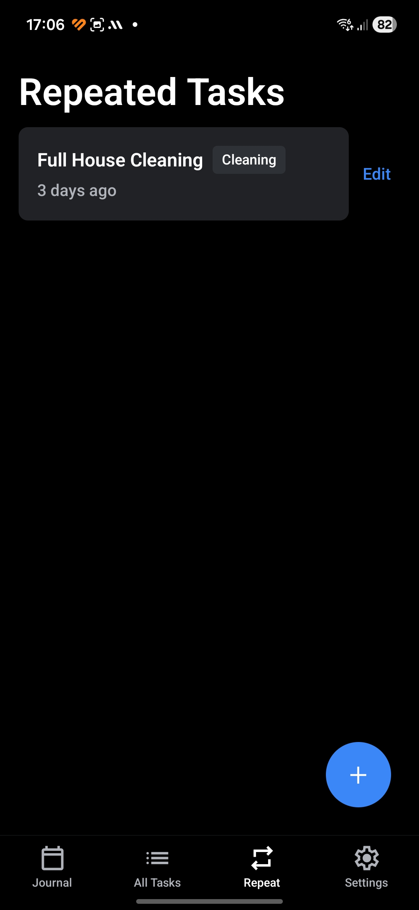

# Task Journal

Similar concept to my other application [FoodJournal](https://github.com/mgenc2077/FoodJournal) but built with React Native to test out the technology. mobile task journal app with calendar view, repeated task templates, categories, and LAN sync. Built with Expo SDK 56.

 

## Features

- **Calendar view** — Monthly grid showing tasks per day. Tap a day to see and manage its tasks.
- **All Tasks** — Browse all tasks grouped by date.
- **Repeated Tasks** — Create task templates (e.g., "Standup", "Gym") with categories. See when each was last logged and view full history.
- **Categories** — Organize repeated tasks into categories (Work, Personal, etc.).
- **LAN Sync** — Sync tasks between devices on the same network via a lightweight Go server.
- **Dark mode** — Automatic light/dark theme based on system preference.

## Tech Stack

| Layer | Technology |
|---|---|
| Framework | Expo SDK 56 (React Native 0.85, React 19) |
| Language | TypeScript (strict mode) |
| Routing | Expo Router (file-based, typed routes) |
| Database | SQLite via `expo-sqlite` |
| Compiler | React Compiler (automatic memoization) |
| Icons | `expo-symbols` (SF Symbols on iOS, Material Symbols on Android) |
| Sync Server | Go with WASM-based SQLite (`ncruces/go-sqlite3`) |

## Getting Started

### Prerequisites

- Node.js 22+
- Expo CLI (`npx expo install`)
- For sync: Docker or Go 1.26+

### Releases

You can download the latest release from the [Releases page](https://github.com/) for the android and sync-server from ghcr.io.

### Local Development

```sh
npm install
npx expo start
```

### Sync Server

```sh
# Docker
docker build -t sync-engine sync-engine/
docker run -p 42061:42061 -v sync-data:/data sync-engine

# Or binary
cd sync-engine && go build -o sync-engine . && ./sync-engine
```

Configure the server URL in Settings → Sync on the device.

## Project Structure

```
├── src/
│   ├── app/                    # Expo Router screens
│   │   ├── (tabs)/             # Tab navigator
│   │   │   ├── index.tsx       # Journal (calendar + tasks)
│   │   │   ├── all-tasks.tsx   # All tasks by date
│   │   │   ├── repeated-tasks.tsx  # Templates + history
│   │   │   └── settings.tsx    # Preferences + sync
│   │   ├── task/[date].tsx     # Task detail screen
│   │   └── _layout.tsx         # Root layout (SQLite + theme)
│   ├── components/             # Reusable UI components
│   │   ├── calendar/           # Calendar grid
│   │   └── task/               # Task form, item, pickers
│   ├── db/                     # Database layer
│   │   ├── schema.ts           # Migrations (v5)
│   │   ├── tasks.ts            # Task CRUD + sync
│   │   ├── repeated-tasks.ts   # RepeatedTask CRUD + sync
│   │   ├── categories.ts       # Category CRUD + sync
│   │   ├── settings.ts         # Local preferences
│   │   ├── sync.ts             # Sync orchestration
│   │   └── sync-settings.ts    # Sync URL/timestamp
│   ├── types/                  # TypeScript interfaces
│   ├── utils/                  # UUIDv7 generation
│   └── constants/              # Theme, colors, spacing
├── sync-engine/                # Go sync server
│   ├── main.go                 # Entry point
│   ├── handlers.go             # HTTP handlers (/sync, /rebuild)
│   ├── db.go                   # SQLite schema + queries
│   ├── models.go               # JSON types
│   ├── uuid.go                 # UUIDv7 generation
│   ├── Dockerfile              # Multi-stage build
│   ├── README.md               # Server docs
│   └── ADAPTATION.md           # Guide for reusing in other apps
├── app.json                    # Expo config
├── eas.json                    # EAS Build profiles
└── .github/workflows/          # CI/CD (APK + Docker)
```

## Database

All entities use UUIDv7 string IDs and Unix millisecond timestamps. Deletes are soft — setting `deleted_at` instead of removing rows. This enables sync to propagate deletions across devices.

| Table | Synced | Description |
|---|---|---|
| `tasks` | Yes | Date, title, notes per day |
| `repeated_tasks` | Yes | Task templates with default notes and category |
| `categories` | Yes | Named groups for repeated tasks |
| `settings` | No | Local preferences (first day of week, sync URL) |
| `sync_meta` | No | Sync state (last sync timestamp) |

## Sync Protocol

Timestamp-based incremental sync over HTTP JSON:

1. Client sends all locally changed records since `last_sync_at`
2. Server upserts each record (server wins on timestamp tie)
3. Server returns all records changed since `last_sync_at`
4. Client merges server records with same conflict resolution
5. Both sides save the sync timestamp

No authentication — designed for trusted LAN use only.

## Release

Push a `v*.*.*` tag to trigger the GitHub Actions workflow:

```sh
git tag v1.0.0
git push origin v1.0.0
```

This builds an APK (via EAS) and pushes the sync-engine Docker image to GHCR.

## License

Private project.
